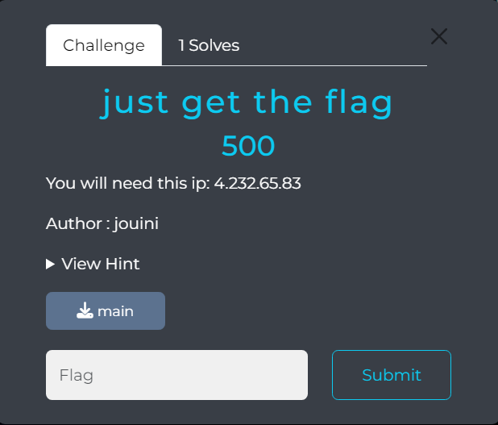
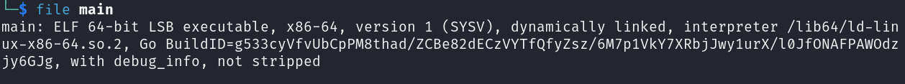
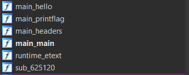
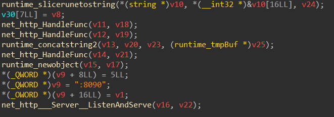
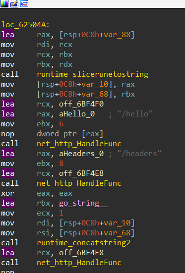
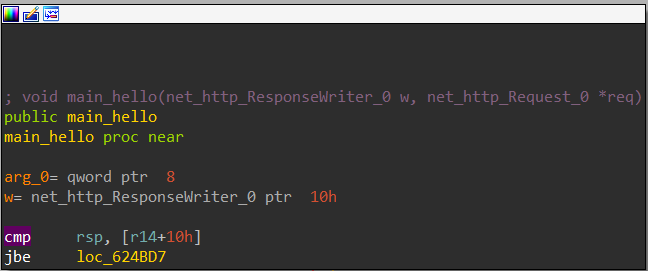
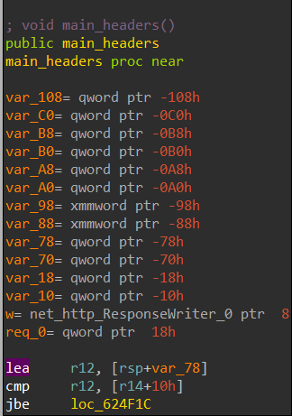
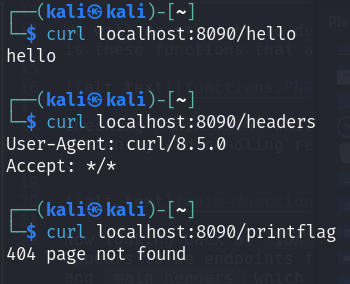
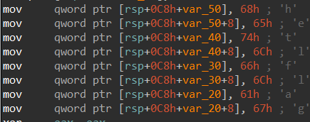
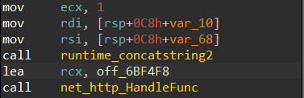

# just get the flag
## Reverse Engineering



In this challenge we were given a file `main` and the description only mentioned a public IP @

## Approach

We starting by analyzing the ELF, and we noticed that it's an ELF 64-bit written in Golang : 



We will go straight to decompiling, I personaly prefer `IDA` for the matter. First thing to take a note for is these functions that appeared: 



Checking `main_main` which is our main function, we can ultimatly understand that it is a web server listening and handling requests and we got `:8090` which may appear to be a port, so we can make note of it :



Now looking back at `IDA View`, there are `/hello` and `/headers` just before `http.handleFunc` that appears to be endpoints for this web server, there is also `http.reponseWriter` function in `main_hello` and `main_headers` which might be a response handler for an endpoint and writing something in response : 







## Testing Endpoints

We are going to try and fetch the web server with `headers` and `hello` URIs, we will run the binary and work on our localhost with the recent found port.

```sh
./main
```

the binary is actually reponding to our requests, but `printflag` is returning `404 Not Found` :



Getting back to `main_main` in `IDA View` we noticed characters stored in `rsp+0xC8` then concatinated to sent to `http.handleFunc` that means this is the third endpoit we are looking for! which is `hetlflag` that should be the one to print back the flag. 





so to get the flag we should sent a get request using `curl` for example :

```sh
curl http://4.232.65.83:8090/hetlflag
```

> flag : park{64e9310f03c092c01134ea409c68bfa323ae5f43}


